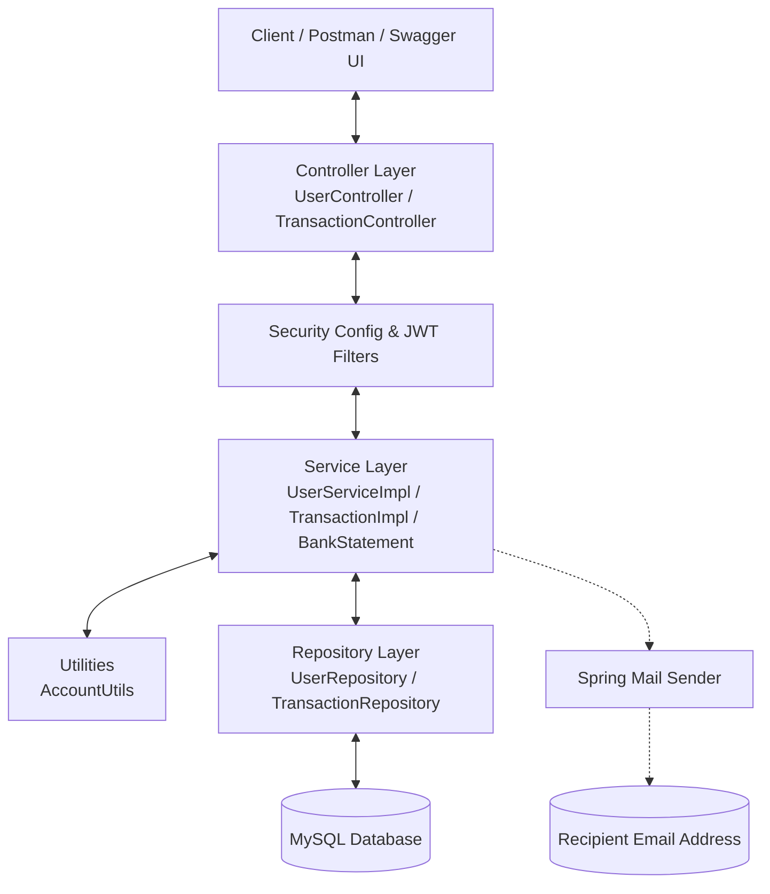

# 🏦 Banking Application API

A modern, secure, and robust Spring Boot-based Banking REST API. This application provides core banking operations, including secure user authentication (JWT + BCrypt), account management, balance inquiries, fund transfers, real-time email notifications, and automated monthly/period bank statement compilation in PDF format emailed directly to customers.

---

## 🛠️ Technology Stack

- **Framework:** Spring Boot 3.5.0 (Java 21)
- **Security:** Spring Security (BCrypt password hashing) & JWT (JSON Web Tokens)
- **Database & ORM:** MySQL Database with Spring Data JPA & Hibernate
- **Build Tool:** Apache Maven
- **PDF Generation:** iTextPDF (v5.5.13.4)
- **Email System:** Spring Boot Starter Mail (SMTP)
- **API Documentation:** Springdoc OpenAPI / Swagger UI (v2.8.8)
- **Containerization:** Docker

---

## 📐 System Architecture

Below is a diagram illustrating the high-level architecture of the application:



---

## 🌟 Key Features

1. **Secure Registration & Auth:** Registration with BCrypt encrypted passwords. Logins are protected and return a JWT access token.
2. **Auto-Generated Account Numbers:** Seamless, unique 10-digit account numbers generated via `Current Year` + `6-digit random number`.
3. **Core Banking Transactions:**
   - **Credit:** Deposit money into any active account.
   - **Debit:** Withdraw money with real-time balance checks to prevent overdrafts.
   - **Transfer:** Secure peer-to-peer transfers with real-time updates for both sender and receiver.
4. **Automated PDF Statements:** Retrieve transaction logs between specified dates, compile them into a formatted PDF using iTextPDF, save them locally, and automatically send them to the account holder's registered email.
5. **Real-time Email Alerts:** Direct email alerts for account creation, successful logins, debits, and credits.

---

## 🗄️ Database Schema

The database contains two main entities: `users` and `transactions`.

### 1. User Entity (`users` table)
- `id` (Long, PK, Auto-increment)
- `firstName`, `lastName`, `otherName` (String)
- `gender`, `address`, `stateOfOrigin` (String)
- `accountNumber` (String, Unique)
- `accountBalance` (BigDecimal)
- `role` (Enum: `ROLE_USER`, `ROLE_ADMIN`)
- `email` (String, Unique)
- `password` (String)
- `phoneNumber`, `alternativePhoneNumber` (String)
- `status` (String: e.g., `"ACTIVE"`)
- `createdAt`, `modifiedAt` (LocalDateTime)

### 2. Transaction Entity (`transactions` table)
- `transactionId` (String, PK, UUID)
- `accountNumber` (String)
- `transactionType` (String: `"CREDIT"` or `"DEBIT"`)
- `amount` (BigDecimal)
- `status` (String: `"success"` or `"failed"`)
- `createdAt`, `modifiedAt` (LocalDate)

---

## 🔌 API Endpoints Documentation

### Authentication & Account Creation

#### 1. Create User Account
- **Endpoint:** `POST /api/user`
- **Access:** Public
- **Request Payload:**
```json
{
  "firstName": "Siddhant",
  "lastName": "Sinha",
  "otherName": "Kumar",
  "gender": "Male",
  "address": "123 Main Street",
  "stateOfOrigin": "Bihar",
  "email": "sidsinha491@gmail.com",
  "password": "securepassword123",
  "phoneNumber": "+919876543210",
  "alternativePhoneNumber": "+918765432109"
}
```
- **Response Payload:**
```json
{
  "responseCode": "002",
  "responseMessage": "Account created successfully",
  "accountInfo": {
    "accountName": "Siddhant Sinha Kumar",
    "accountBalance": 0.00,
    "accountNumber": "2026385921"
  }
}
```

#### 2. User Login
- **Endpoint:** `POST /api/user/login`
- **Access:** Public (See Developer Notes below)
- **Request Payload:**
```json
{
  "email": "sidsinha491@gmail.com",
  "password": "securepassword123"
}
```
- **Response Payload:**
```json
{
  "responseCode": "LOGIN_SUCCESS",
  "responseMessage": "eyJhbGciOiJIUzI1NiJ9.eyJzdWIiOiJzaWRzaW5oYTQ5MUBnbWFpbC5jb20iLCJpYXQiOjE2ODg0MT...",
  "accountInfo": null
}
```
*Note: The JWT token is returned in the `responseMessage` field.*

---

### Banking Operations (Requires Bearer Token)

All requests below must include the authorization header:
`Authorization: Bearer <your_jwt_token>`

#### 3. Balance Enquiry
- **Endpoint:** `GET /api/user/balanceEnquiry`
- **Request Body:**
```json
{
  "accountNumber": "2026385921"
}
```
- **Response Payload:**
```json
{
  "responseCode": "004",
  "responseMessage": "Account found successfully",
  "accountInfo": {
    "accountName": "Siddhant Sinha Kumar",
    "accountBalance": 5000.00,
    "accountNumber": "2026385921"
  }
}
```

#### 4. Name Enquiry
- **Endpoint:** `GET /api/user/nameEnquiry`
- **Request Body:**
```json
{
  "accountNumber": "2026385921"
}
```
- **Response:** `Siddhant Sinha Kumar` (Plaintext String)

#### 5. Credit Account
- **Endpoint:** `POST /api/user/credit`
- **Request Payload:**
```json
{
  "accountNumber": "2026385921",
  "amount": 1500.00
}
```
- **Response Payload:**
```json
{
  "responseCode": "005",
  "responseMessage": "Account credited successfully",
  "accountInfo": {
    "accountName": "Siddhant Sinha Kumar",
    "accountBalance": 6500.00,
    "accountNumber": "2026385921"
  }
}
```

#### 6. Debit Account
- **Endpoint:** `POST /api/user/debit`
- **Request Payload:**
```json
{
  "accountNumber": "2026385921",
  "amount": 500.00
}
```
- **Response Payload:**
```json
{
  "responseCode": "007",
  "responseMessage": "Account debited successfully",
  "accountInfo": {
    "accountName": "Siddhant Sinha Kumar",
    "accountBalance": 6000.00,
    "accountNumber": "2026385921"
  }
}
```

#### 7. Fund Transfer
- **Endpoint:** `POST /api/user/transfer`
- **Request Payload:**
```json
{
  "sourceAccountNumber": "2026385921",
  "destinationAccountNumber": "2026999999",
  "amount": 2000.00
}
```
- **Response Payload:**
```json
{
  "responseCode": "008",
  "responseMessage": "Transfer successful",
  "accountInfo": null
}
```

---

### Transaction History & PDF Statement Generation

#### 8. Generate and Email Statement
- **Endpoint:** `GET /bankStatement`
- **Access:** Authenticated (Requires Bearer Token)
- **Query Parameters:**
  - `accountNumber`: Target account number (e.g. `2026385921`)
  - `startDate`: Start date in ISO format (`yyyy-MM-dd`)
  - `endDate`: End date in ISO format (`yyyy-MM-dd`)
- **Example Request URL:** `/bankStatement?accountNumber=2026385921&startDate=2026-08-01&endDate=2026-08-31`
- **Behavior:**
  1. Filters transactions for the specified account within the date range.
  2. Compiles a transaction table into a PDF file at `C:\Users\Public\Documents\MyStatement.pdf`.
  3. Sends an email to the user's registered address with the PDF statement attached.
  4. Returns the JSON list of transaction records found.

---

## ⚙️ Configuration & Setup

### 1. Prerequisites
- **Java:** SDK 21
- **Maven:** installed (or use `./mvnw`)
- **MySQL Database:** Local or Cloud instance

### 2. Properties Setup (`src/main/resources/application.properties`)
Update the following settings to match your local development environment:

```properties
# Database Configurations
spring.datasource.url=jdbc:mysql://localhost:3306/bank
spring.datasource.username=root
spring.datasource.password=your_database_password
spring.datasource.driver-class-name=com.mysql.cj.jdbc.Driver
spring.jpa.hibernate.ddl-auto=update

# SMTP Mail Configurations (e.g. Gmail SMTP)
spring.mail.host=smtp.gmail.com
spring.mail.port=587
spring.mail.username=your_gmail_username@gmail.com
spring.mail.password=your_gmail_app_password
spring.mail.properties.mail.smtp.auth=true
spring.mail.properties.mail.smtp.starttls.enable=true

# JWT Configurations
app.jwt-secret=your_base64_encoded_hmac_sha_key_at_least_256_bits
app.jwt-expiration=86400000
```

---

## 🚀 Running the Application

### Running Locally
1. Clone the repository and navigate to the project directory:
   ```bash
   git clone https://github.com/Siddhant444-dev/BankingApplication.git
   cd BankingApplication
   ```
2. Create a MySQL database named `bank`.
3. Build the project using Maven:
   ```bash
   mvn clean package
   ```
4. Run the application:
   ```bash
   mvn spring-boot:run
   ```
   or
   ```bash
   java -jar target/BankingApplication-0.0.1-SNAPSHOT.jar
   ```
5. Access the API documentation at:
   - Swagger UI: `http://localhost:8080/swagger-ui/index.html`

### Running with Docker
1. Build the application jar file:
   ```bash
   mvn clean package
   ```
2. Build the Docker image:
   ```bash
   docker build -t banking-app .
   ```
3. Run the container (make sure to update DB host to reach your MySQL server):
   ```bash
   docker run -p 8080:8080 --name banking-app-container banking-app
   ```

---

## ⚠️ Important Developer Notes

1. **Security Config / Path Mismatch:**
   - In `SecurityConfig.java`, path `/api/auth/login` is permitted as public, but the actual login endpoint in `UserController.java` is mapped to `/api/user/login`. If login requests return a `403 Forbidden` response, update the `SecurityConfig` configuration matchers from `/api/auth/login` to `/api/user/login`.
2. **Default Role:**
   - Currently, all registering users are assigned the role `ROLE_ADMIN` by default in `UserServiceImpl.java`. Update this assignment logic if you wish to assign `ROLE_USER` or configure dynamic roles.
3. **Database DDL:**
   - `spring.jpa.hibernate.ddl-auto` is set to `update`. In a production environment, change this value to `validate` or `none` and use migration tools like Flyway or Liquibase.
4. **Statement Save Location:**
   - The PDF statement generator saves files locally to `C:\Users\Public\Documents\MyStatement.pdf`. Ensure this directory path exists and has appropriate write permissions. Change this directory value in `BankStatement.java` if deploying on Linux/macOS.
